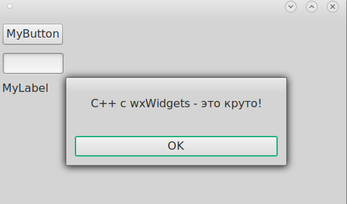

# CodeLite_wxWidgets_demo
Простейший пример работы с wxWidgets на C++ в CodeLite (linux, debian)



## main.h:

```

class MainFrame : public MainFrameBase
{
public:
    MainFrame(wxWindow* parent);
    virtual ~MainFrame();

protected:
    // protected event handlers
    virtual void OnCloseFrame(
        wxCloseEvent& event); // Копируем сюда из gui.h те методы, которые хотим реально реализовать
    virtual void myClick(wxCommandEvent& event); // иначе все объявленные методы в gui.h останутся "пустыми"
};
```

## main.cpp:

```
// ЭТО РЕАЛИЗАЦИЯ НАШЕГО МЕТОДА!
void MainFrame::OnCloseFrame(wxCloseEvent& event)
{
    Destroy();
}

// ЭТО РЕАЛИЗАЦИЯ НАШЕГО МЕТОДА!
void MainFrame::myClick(wxCommandEvent& event)
{
    wxMessageBox(_T("С++ с wxWidgets - это круто!"));
}
```


# CodeLite_wxWidgets_demo
